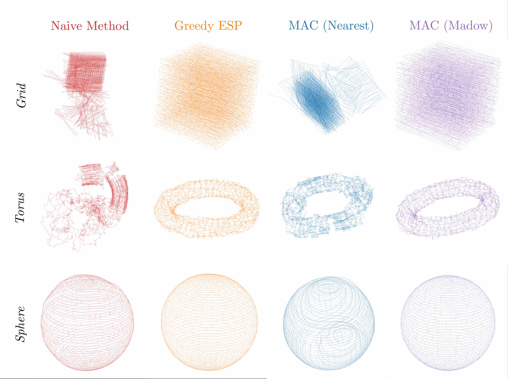
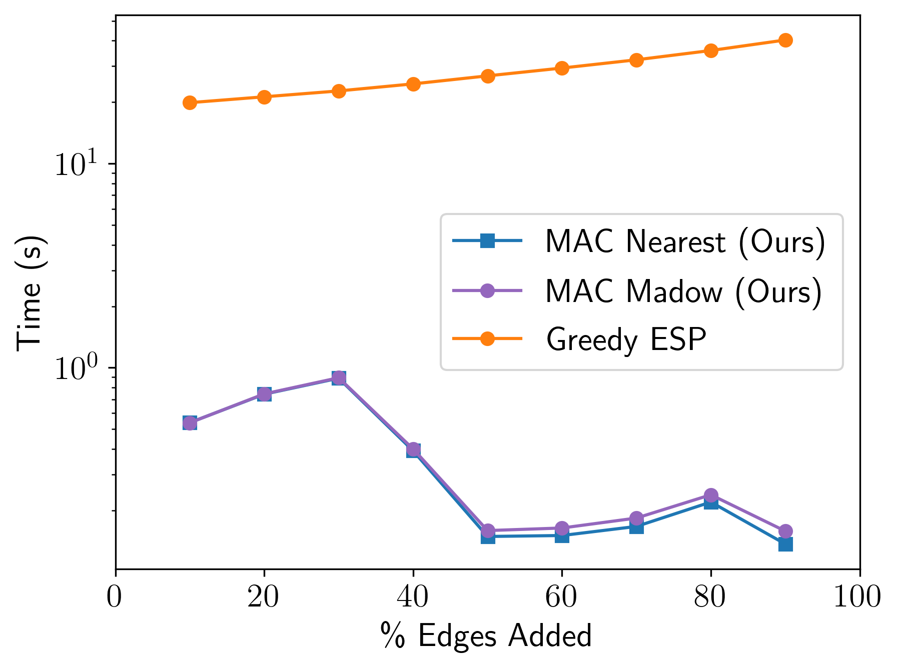

# mac
Maximizing algebraic connectivity for graph sparsification [[paper on arXiv](https://arxiv.org/abs/2403.19879)]

MAC is an algorithm for solving the *maximum algebraic connectivity augmentation* problem. Specifically, given a graph containing a (potentially empty) set of "fixed" edges and a set of "candidate" edges, as well as a cardinality constraint K, MAC tries to find the set of K candidate edges whose addition to the fixed edges produces a graph with the largest possible [algebraic connectivity](https://en.wikipedia.org/wiki/Algebraic_connectivity). MAC does this by solving a convex relaxation of the maximum algebraic connectivity augmentation problem (which is itself NP-hard). The relaxation allows for "soft" inclusion of edges in the candidate set. When a solution to the relaxation is obtained, we _round_ it to the feasible set for the original problem.

## Quick Demo

The `mac` library contains the MAC algorithm with two different rounding schemes based on the "soft" inclusion weights computed by the relaxation:
- **Nearest**: round to the nearest feasible solution by taking the K candidate edges with the largest weights
- **Madow**: using the Madow rounding scheme (also known as [systematic sampling](https://en.wikipedia.org/wiki/Systematic_sampling)) to treat the weights as inclusion probabilities

We have empirically found that the Madow rounding scheme produces better results
with relatively little additional computational cost, so we recommend using it.

Additionally, the `mac` library implements the following baseline methods:
- **GreedyESP**: the greedy algorithm from [Khosoussi et al. 2016](https://arxiv.org/abs/1604.01116)
- **Naive**: take the K candidate edges with the largest weights

In this image, you can see all of these methods applied to several standard
pose-graph SLAM datasets, which are then solved using
[SE-Sync](https://github.com/david-m-rosen/SE-Sync). Effectively, we
evaluate the quality of the sparsification methods by the quality of the
resulting SLAM estimates. The timing results are from the Torus experiment.

<p align="center">
    
</p>

## Getting started

MAC can be installed by cloning the `mac` repo and running `pip` from the project root:
```bash
git clone git@github.com:MarineRoboticsGroup/mac.git
cd mac
pip install -e .
```


You can also install MAC via `pip` without cloning if you want to use the library directly:
```bash
pip install git+https://github.com/MarineRoboticsGroup/mac
```

Now you are ready to use MAC.

### Running tests

You can run unit and regression tests for MAC by simply running:
```bash
pytest
```
from the project root directory. This will also run any benchmarks in the test directory.

## Running the examples

### Basic examples

From the `examples` directory, run:
```bash
python3 random_graph_sparsification.py
```
which demonstrates our sparsification approach on an [Erdos-Renyi graph](https://en.wikipedia.org/wiki/Erd%C5%91s%E2%80%93R%C3%A9nyi_model).

In the same directory, running:
```bash
python3 petersen_graph_sparsification.py
```
will show the results of our approach on the [Petersen graph](https://en.wikipedia.org/wiki/Petersen_graph).

In each case, the set of fixed edges is a chain, and the remaining edges are considered candidates.

### Pose graph sparsification

For the pose graph examples, you will need to install [SE-Sync](https://github.com/david-m-rosen/SE-Sync) with [Python bindings](https://github.com/david-m-rosen/SE-Sync#python).

If you want to build the bindings with a given `conda` environment, you can do so with:
```bash
conda activate [your environment]
mkdir -p /path/to/SESync/C++/build
cd /path/to/SESync/C++/build
cmake -DBUILD_PYTHON_BINDINGS=ON -DPython3_EXECUTABLE=$(which python) ..
```

Once that is installed, you need to modify the SE-Sync path in `g2o_experiment.py`:

```python
# SE-Sync setup
sesync_lib_path = "/path/to/SESync/C++/build/lib"
sys.path.insert(0, sesync_lib_path)
```

Finally, run:
```bash
python3 g2o_experiment.py [path to .g2o file]
```
to run MAC for pose graph sparsification and compute SLAM solutions. Several plots will be saved in the `examples` directory for inspection.

### Baseline methods

The GreedyESP (Khosoussi et al. 2019) baseline requires scikit-sparse, which in turn requires SuiteSparse. You can install SuiteSparse and scikit-sparse as follows, depending on your operating system:

#### MacOS installation
On a Mac, you can install SuiteSparse via `brew` by running:
```bash
brew install suite-sparse
```

You then need to explicitly provide the path to suite-sparse in your call to pip, for example:
```bash
SUITESPARSE_INCLUDE_DIR=/usr/local/Cellar/suite-sparse/7.0.1/include SUITESPARSE_LIBRARY_DIR=/usr/local/Cellar/suite-sparse/7.0.1/lib pip3 install scikit-sparse
```

#### Linux installation
On Linux, you can simply run:
```bash
sudo apt-get install python-scipy libsuitesparse-dev
pip install --user scikit-sparse
```

#### Conda
You may also be able to install `scikit-sparse` entirely over `conda`. See these [instructions](https://scikit-sparse.readthedocs.io/en/latest/overview.html#installation) for more details.

## Reference

If you found this code useful, please cite our paper [here](https://arxiv.org/abs/2403.19879):
```bibtex
@article{doherty2024mac,
  title={M{AC}: {G}raph {S}parsification by {M}aximizing {A}lgebraic {C}onnectivity},
  author={Doherty, Kevin and Papalia, Alan and Huang, Yewei and Rosen, David and Englot, Brendan and Leonard, John},
  journal={arXiv preprint arXiv:2403.19879},
  year={2024}
}

@inproceedings{doherty2022spectral,
  title={Spectral {M}easurement {S}parsification for {P}ose-{G}raph {SLAM}},
  author={Doherty, Kevin J and Rosen, David M and Leonard, John J},
  booktitle={2022 IEEE/RSJ International Conference on Intelligent Robots and Systems (IROS)},
  pages={01--08},
  year={2022},
  organization={IEEE}
}
```

## Notes

- Currently `mac.py` assumes that there is at most one candidate edge between
  any pair of nodes. If your data includes multiple edges between the same pair
  of nodes, you can combine the edges into a single edge with weight equal to
  the sum of the individual edge weights before using MAC.

## Building the Docs

You need Sphinx:

```bash
pip install sphinx
```

Then, from the project root:

```bash
$ cd docs/
docs/$ make html
```

The file `docs/build/index.html` is the root documentation page.

To update the docs, run:
```
docs/$ sphinx-apidoc ../mac/ source/
docs/$ make html
```
